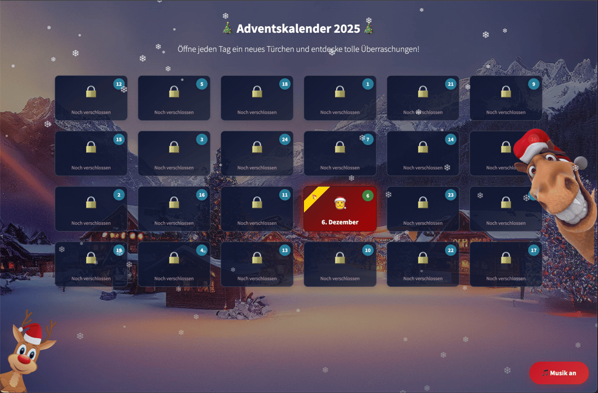
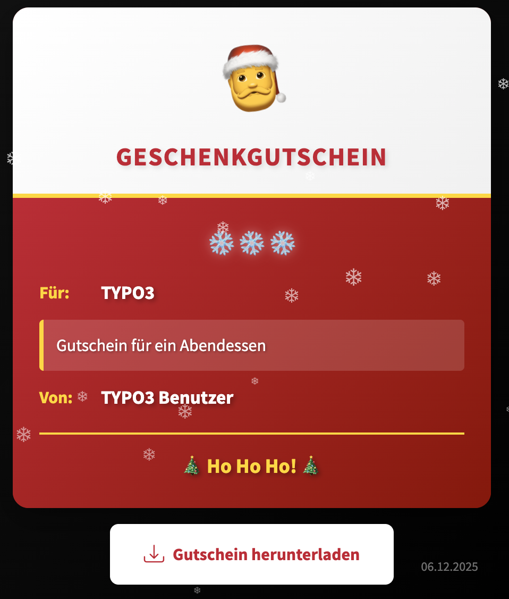

.. include:: /Includes.rst.txt

.. _introduction:

============
Introduction
============

What does it do?
================

The Adventskalender extension provides a fully-featured interactive advent calendar
for TYPO3 v13. It includes:

* 24 customizable doors for each day in December
* Digital voucher system with multiple designs
* Multimedia support (images, videos, audio)
* Background music with toggle
* Snow animation
* Glass morphism design
* Lightbox view
* Multi-language support (German, English, Russian)

Screenshots
===========

   The advent calendar showing all 24 doors

   Example of a digital voucher
